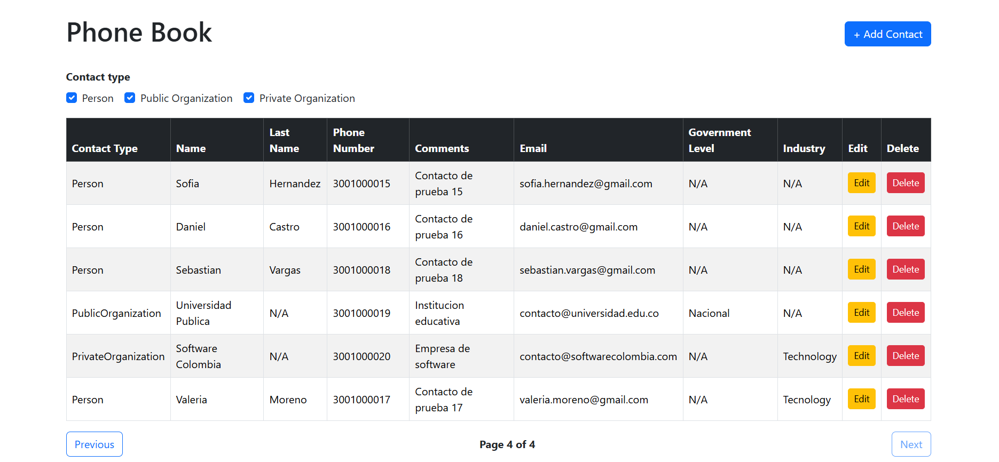
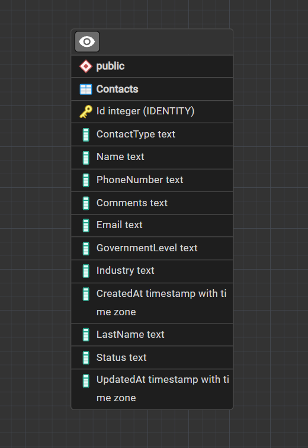
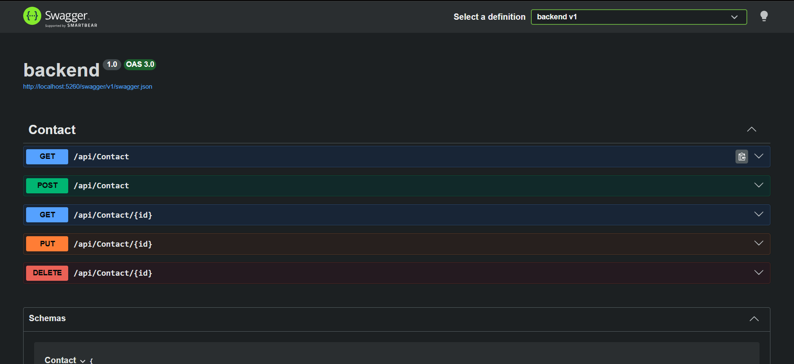

# Phone Book Technical Test

Web-based phone book application developed as part of the GUDAR DEVS Developer Competency Test.

The application consists of an Angular frontend connected to a REST API developed with ASP.NET Core, using PostgreSQL and Entity Framework Core for data persistence.

---

## Author

**Valentina Cabas**

---

## Technologies

### Backend

* **C#**
* **ASP.NET Core**
* **Entity Framework Core**
* **PostgreSQL**
* **Npgsql**
* **Swagger / OpenAPI**

### Frontend

* **Angular**
* **TypeScript**
* **Bootstrap 5**
* **ng-bootstrap**

### Tools

* **Git**
* **GitHub**
* **Visual Studio Code**

---

## Project Structure

The project is divided into two main applications:

```text
phone-book-technical-test/
│
├── backend/
│   ├── Controllers/
│   ├── Data/
│   ├── DTOs/
│   ├── Enums/
│   ├── Migrations/
│   ├── Models/
│   ├── Repositories/
│   │   └── Interfaces/
│   ├── Services/
│   │   └── Interfaces/
│   ├── Properties/
│   ├── Program.cs
│   ├── appsettings.json
│   └── backend.csproj
│
├── frontend/
│   ├── src/
│   │   └── app/
│   │       ├── components/
│   │       ├── models/
│   │       ├── services/
│   │       └── ...
│   ├── angular.json
│   ├── package.json
│   └── tsconfig.json
│
└── README.md
```

---

# Architecture

The application follows a layered architecture on the backend.

```text
Angular Frontend
       ↓
REST API
       ↓
Controller
       ↓
Service
       ↓
Repository
       ↓
Entity Framework Core
       ↓
PostgreSQL
```

### Backend Responsibilities

**Controller**

Receives HTTP requests and returns HTTP responses.

**Service**

Contains the application's business logic and validation rules.

**Repository**

Handles database operations through Entity Framework Core.

**DTOs**

Define the data received when creating and updating contacts.

**Models**

Represent the application's database entities.

**Data**

Contains the Entity Framework Core `DbContext` configuration.

---

# Features

## Contact Management

The application supports the complete CRUD workflow:

* Retrieve contacts
* Retrieve a contact by ID
* Create contacts
* Edit contacts
* Delete contacts
* Soft delete
* Filter contacts by type
* Paginate contacts

---

## Contact Types

The application supports three contact types:

```text
Person
PublicOrganization
PrivateOrganization
```

The user can select any combination of contact types using the filters.

Examples:

```text
Person
```

```text
Person + PublicOrganization
```

```text
PublicOrganization + PrivateOrganization
```

```text
Person + PublicOrganization + PrivateOrganization
```

---

## Contact Information

Contacts can contain the following information:

```text
ContactType
Name
LastName
PhoneNumber
Comments
Email
GovernmentLevel
Industry
```

The additional fields allow the application to store information relevant to different contact types.

---

# Frontend

The frontend is implemented completely with Angular.

Server-side rendering is not used.

## Frontend Features

### Contact Data Grid

The main page displays contacts in a data grid with:

* Contact Type
* Name
* Last Name
* Phone Number
* Comments
* Email
* Government Level
* Industry
* Edit
* Delete

### Add Contact

The **+ Add Contact** button opens an Angular modal containing the contact form.

The form allows the user to enter:

* Contact type
* Name
* Last name
* Phone number
* Comments
* Email
* Government level
* Industry

Before creating the contact, the application displays a confirmation modal.

### Edit Contact

The **Edit** button opens the same modal with the selected contact's information already loaded.

After modifying the information, the user can save the changes or cancel.

A confirmation dialog is displayed before applying the update.

### Delete Contact

The **Delete** button opens a confirmation modal.

The user can choose:

```text
Yes
No
```

Selecting **Yes** sends the delete request to the API.

Selecting **No** closes the confirmation dialog without deleting the contact.

### Filtering

Contacts can be filtered by contact type using checkboxes.

Multiple contact types can be selected at the same time.

### Pagination

The contact list includes client-side pagination.

The current implementation displays five contacts per page.

The user can navigate using:

```text
Previous
Next
```

### Frontend Validation

The contact form validates required information before sending requests to the API.

The following fields are required:

* Name
* Last Name
* Phone Number

Email format is also validated when an email is provided.

---

# Modals

The application uses **ng-bootstrap** for modal dialogs.

Two modal components are used:

```text
ContactFormModal
ConfirmModal
```

`ContactFormModal` is used for creating and editing contacts.

`ConfirmModal` is used to confirm actions such as creating, updating, and deleting contacts.

---

# Backend

The backend is implemented using ASP.NET Core and exposes a REST API consumed by the Angular frontend.

The API is responsible for:

* Contact management
* Business logic
* Validation
* Database operations
* Soft deletion

---

# API Endpoints

## Get Contacts

```http
GET /api/contact
```

Returns all active contacts.

---

## Get Contact by ID

```http
GET /api/contact/{id}
```

Returns an active contact by its ID.

If the contact does not exist or is inactive, the API returns:

```text
404 Not Found
```

---

## Create Contact

```http
POST /api/contact
```

Creates a new contact.

Example request:

```json
{
  "contactType": "PublicOrganization",
  "name": "Reynaldo",
  "lastName": "Cabas",
  "phoneNumber": "322 6422918",
  "comments": "Contacto de prueba",
  "email": "rey@gmail.com",
  "governmentLevel": "Internacional",
  "industry": "comercial"
}
```

---

## Update Contact

```http
PUT /api/contact/{id}
```

Updates an existing active contact.

---

## Delete Contact

```http
DELETE /api/contact/{id}
```

Deletes a contact using soft delete.

The record is not physically removed from PostgreSQL. Instead, its status changes from:

```text
Active
```

to:

```text
Inactive
```

Inactive contacts are excluded from normal queries.

---

# Database

The application uses **PostgreSQL** as its relational database.

Entity Framework Core is used as the data access technology.

The main database entity is:

```text
Contacts
```

Main fields include:

```text
Id
ContactType
Name
LastName
PhoneNumber
Comments
Email
GovernmentLevel
Industry
Status
CreatedAt
UpdatedAt
```

The application uses migrations to create and update the database schema.

---

# Validation

Validation is implemented on both the frontend and backend.

## Frontend

The Angular form validates:

* Required name
* Required last name
* Required phone number
* Email format

## Backend

The API validates incoming DTOs and applies business rules.

The application also checks that an active contact does not already use the same email address.

Email comparison is case-insensitive.

---

# Soft Delete

The application uses soft deletion instead of physically removing contacts from the database.

When a contact is deleted:

```text
Status = Inactive
```

The record remains in PostgreSQL, but inactive contacts are not returned by the normal contact queries.

This approach preserves historical data while keeping deleted contacts out of the active phone book.

---

# CORS

The backend is configured to allow requests from the Angular development application.

The Angular application runs by default on:

```text
http://localhost:4200
```

The ASP.NET Core API runs by default on:

```text
http://localhost:5260
```

---

# Screenshots

## Phone Book Application

The Angular application provides the main contact grid, filters, pagination, and CRUD actions.



## Database

Example PostgreSQL database structure and contact records.



## Swagger

The REST API can be inspected and tested using Swagger/OpenAPI.



---

# Project Setup and Execution

## Prerequisites

Make sure the following software is installed:

* .NET SDK
* Node.js
* Angular CLI
* PostgreSQL
* Git

---

# Backend Setup

## 1. Clone the Repository

```powershell
git clone https://github.com/valncabs/phone-book-technical-test.git
```

Navigate to the project:

```powershell
cd phone-book-technical-test
```

---

## 2. Navigate to the Backend

```powershell
cd backend
```

---

## 3. Verify .NET

```powershell
dotnet --version
```

---

## 4. Configure PostgreSQL

Create a PostgreSQL database named:

```text
phonebook
```

Configure the connection string in:

```text
backend/appsettings.json
```

Example:

```json
{
  "ConnectionStrings": {
    "DefaultConnection": "Host=localhost;Port=5432;Database=phonebook;Username=postgres;Password=YOUR_PASSWORD"
  }
}
```

Replace:

```text
YOUR_PASSWORD
```

with the password configured for your PostgreSQL user.

For security reasons, real passwords should not be committed to the repository.

---

## 5. Restore Backend Dependencies

From the `backend` folder:

```powershell
dotnet restore
```

---

## 6. Apply Database Migrations

```powershell
dotnet ef database update
```

This creates or updates the database schema using Entity Framework Core migrations.

---

## 7. Build the Backend

```powershell
dotnet build
```

Expected result:

```text
Build succeeded.
```

---

## 8. Run the API

```powershell
dotnet run
```

The API will be available at:

```text
http://localhost:5260
```

Keep this terminal running while using the frontend.

---

# Swagger

With the API running, open:

```text
http://localhost:5260/swagger
```

Swagger allows the available REST API endpoints to be viewed and tested.

Available endpoints:

```text
GET     /api/Contact
GET     /api/Contact/{id}
POST    /api/Contact
PUT     /api/Contact/{id}
DELETE  /api/Contact/{id}
```

---

# Frontend Setup

Open a second terminal.

From the project root:

```powershell
cd phone-book-technical-test
```

Navigate to the frontend:

```powershell
cd frontend
```

---

## 1. Install Dependencies

```powershell
npm install
```

---

## 2. Run Angular

```powershell
ng serve
```

The Angular application will be available at:

```text
http://localhost:4200
```

Open that URL in your browser.

---

# Complete Setup Flow

For a new environment, the basic execution flow is:

### Terminal 1 — Backend

```powershell
cd phone-book-technical-test
cd backend
dotnet restore
dotnet ef database update
dotnet build
dotnet run
```

Backend:

```text
http://localhost:5260
```

Swagger:

```text
http://localhost:5260/swagger
```

### Terminal 2 — Frontend

```powershell
cd phone-book-technical-test
cd frontend
npm install
ng serve
```

Frontend:

```text
http://localhost:4200
```

---

# Git Workflow

The project was developed using separate branches for the main application layers.

```text
main
  ↑
develop
  ↑
feature/setup-project
feature/setup-frontend
```

The backend and frontend were developed separately and then integrated into the main development branch.

---

# Technical Summary

This project demonstrates a full-stack CRUD application using:

```text
Angular
   ↓
REST API
   ↓
ASP.NET Core
   ↓
Entity Framework Core
   ↓
PostgreSQL
```

The application implements:

* Full CRUD operations
* REST API
* PostgreSQL persistence
* Entity Framework Core
* Layered backend architecture
* Angular frontend
* Bootstrap styling
* ng-bootstrap modals
* Contact type filtering
* Pagination
* Frontend validation
* Backend validation
* Duplicate email validation
* Soft delete
* Swagger/OpenAPI documentation
* CORS configuration
* Git/GitHub workflow